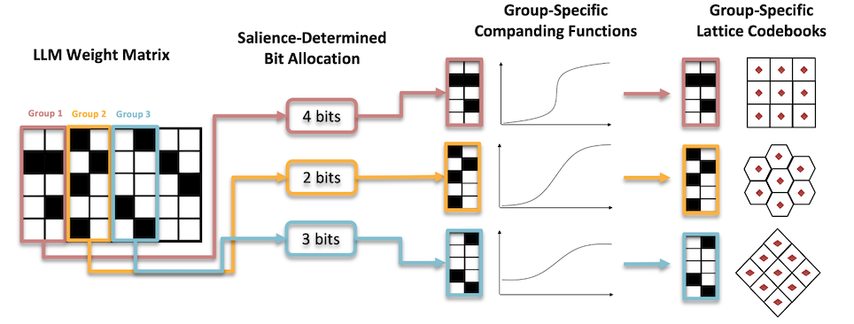

# GLVQ — Learning Grouped Lattice Vector Quantizers for Low-Bit LLM Compression  

<h5 align="center"> 

[]()
[]()
[]()
 <br>

</h5>

Welcome to the official code repository for NeurIPS 2025 paper "[**Learning Grouped Lattice Vector Quantizers for Low-Bit LLM Compression**]()".


## 🚫 Code Release Status

This repository currently hosts documentation only.  
As this work is partially funded by **Alibaba Group**, the code release is pending internal legal / compliance approval.

- Status: **Under Alibaba legal/compliance review**
- ETA: **Will be released once approval is granted**

Please **watch / star** this repo to get notified when the code becomes available.


## 🔍 What is GLVQ?

GLVQ is a **post-training quantization (PTQ)** framework for LLMs that learns **group-specific lattice vector quantizers** to encode weights at 2–4 bits while preserving accuracy and decoding efficiency.


## 🧠 Conceptual Overview

<!--  -->
<p align="center">
  
</p>


## 📊 Main Results (excerpt from Table 1 of paper)

| Method | Bits | WikiText2 (2-70) ↓ | C4 (2-70) ↓ |
|-------:|:----:|:------------------:|:-----------:|
| FP16 | 16 | 3.12 | 4.97 |
| QuIP# | 2 | 3.91 | 5.71 |
| QTIP | 2 | 3.78 | 5.56 |
| **GLVQ-8D (ours)** | **2** | **3.62** | **5.25** |
| **GLVQ-32D (ours)** | **2** | **3.36** | **5.04** |

GLVQ achieves **lower perplexity** while maintaining **similar throughput**.


## 🔜 TODOs
- [ ] Release training/testing codes.


## 📂 Contact
If you have further questions, please open an issue or contact <xi.zhang@ntu.edu.sg>.

Discussions and potential collaborations are also welcome.


## 📌 Citation

```bibtex
@inproceedings{GLVQ,
  title = {Learning Grouped Lattice Vector Quantizers for Low-Bit LLM Compression},
  author = {Zhang, Xi and Wu, Xiaolin and Wang, Jiamang and Lin, Weisi},
  booktitle = {Advances in Neural Information Processing Systems (NeurIPS)},
  year = {2025}
}
